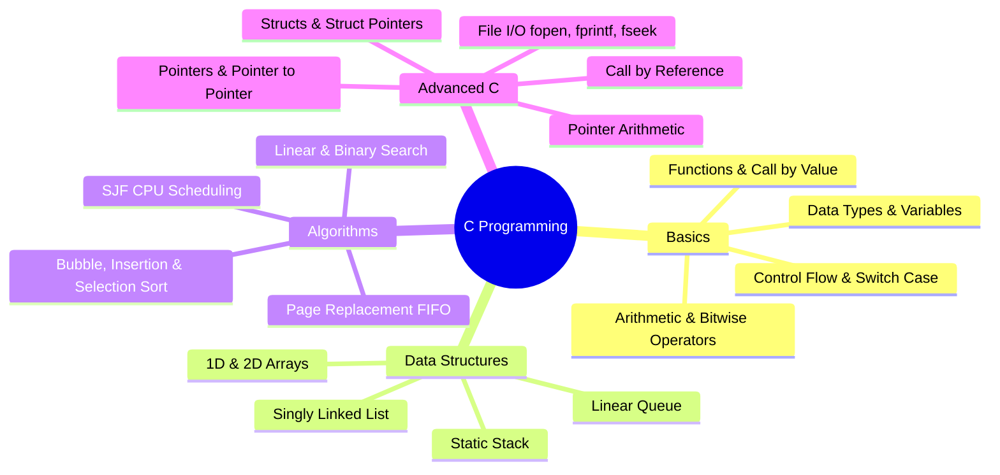

# 🚀 C & Data Structures Programming Repository

[](https://en.wikipedia.org/wiki/C_(programming_language))
[](https://en.wikipedia.org/wiki/C%2B%2B)
[](https://gcc.gnu.org/)
[]()
[]()

Welcome to the **C & Data Structures Programming Repository**! This repository is a comprehensive, well-structured collection of C and C++ programs covering foundational programming principles, core data structures, classic algorithms, pointers, memory manipulation, file I/O, structures, and operating system scheduling algorithms.

---

## 📑 Table of Contents

- [📁 Repository Structure](#-repository-structure)
- [📚 Program Catalog & Detailed Index](#-program-catalog--detailed-index)
  - [1. Data Structures & Algorithms (DSA)](#1-data-structures--algorithms-dsa)
  - [2. Operating System & Scheduling Algorithms](#2-operating-system--scheduling-algorithms)
  - [3. Structures & Records Management](#3-structures--records-management)
  - [4. File Handling & System I/O](#4-file-handling--system-io)
  - [5. Pointers & Memory Management](#5-pointers--memory-management)
  - [6. Strings & Text Processing](#6-strings--text-processing)
  - [7. Arrays & Matrix Operations](#7-arrays--matrix-operations)
  - [8. Functions & Recursion](#8-functions--recursion)
  - [9. Mathematics & Number Theory](#9-mathematics--number-theory)
  - [10. Conditionals, Control Flow & Practical Utilities](#10-conditionals-control-flow--practical-utilities)
  - [11. Basics, Operators & Fundamentals](#11-basics-operators--fundamentals)
- [🛠️ Compilation & Execution Guide](#️-compilation--execution-guide)
- [📌 Key Concepts Mastered](#-key-concepts-mastered)
- [👤 Author](#-author)

---

## 📁 Repository Structure

```text
C_Programs/
├── DSA/                      # Dedicated Data Structures & Algorithms module
│   ├── binary.c              # Binary Search implementation
│   ├── bubble.c              # Bubble Sort algorithm
│   ├── insertion.c           # Insertion Sort algorithm
│   ├── linear.c              # Linear Search implementation
│   ├── list.c                # Singly Linked List (Full CRUD operations)
│   ├── Q.C                   # Linear Queue (Array implementation)
│   ├── selection.c           # Selection Sort algorithm
│   └── stack.c               # Stack (Push, Pop, Peek, Display)
├── PageReplacement.cpp       # FIFO Page Replacement algorithm (OS)
├── sjf.c                     # Shortest Job First (SJF) CPU Scheduling
├── file.c                    # File I/O: Storing student report cards
├── countfiles.c              # File I/O: Character, word, and line counter
├── opfile.c                  # File I/O: Random access with fseek & ftell
├── assign.c                  # Structs + File output: Student grade generator
├── ArrStruct.c               # Array of structures
├── PointStruct.c             # Structure with pointers & averages
├── struct.c                  # Call-by-value vs Call-by-reference in structs
├── pointer.c, po.c, poo.c    # Pointer arithmetic & pointer-to-pointer
├── STR.c, strcat.c, ...      # Standard string manipulations
├── f.c, fib.c, gcd.c, ...    # Recursive functions (Factorial, Fibonacci, GCD)
└── ... (75+ programs in total)
```

---

## 📚 Program Catalog & Detailed Index

### 1. Data Structures & Algorithms (DSA)

Located in the [`DSA/`](DSA/) directory:

| Program | Filename | Description | Core Operations / Concepts |
| :--- | :--- | :--- | :--- |
| **Singly Linked List** | [`DSA/list.c`](DSA/list.c) | Complete menu-driven Singly Linked List | Node creation, Insertion (Beginning, End, Specific Position), Deletion (First, Last, Value), Traversal, Searching, Dynamic Memory Allocation (`malloc`, `free`) |
| **Stack (Array)** | [`DSA/stack.c`](DSA/stack.c) | LIFO Stack implementation using static array | `Push()`, `Pop()`, `Display()`, Overflow & Underflow handling |
| **Linear Queue** | [`DSA/Q.C`](DSA/Q.C) | FIFO Linear Queue implementation using static array | `Enqueue()`, `Dequeue()`, `Display()`, Front & Rear pointer management |
| **Binary Search** | [`DSA/binary.c`](DSA/binary.c) | Search element in $O(\log n)$ on sorted array | Divide and conquer, Midpoint calculation, Range adjustment |
| **Linear Search** | [`DSA/linear.c`](DSA/linear.c) | Sequential search for target key | Sequential scan, Element matching, Index reporting |
| **Bubble Sort** | [`DSA/bubble.c`](DSA/bubble.c) | Classic sorting by swapping adjacent items | Nested loops, Adjacent comparison, In-place sorting |
| **Insertion Sort** | [`DSA/insertion.c`](DSA/insertion.c) | Insertion sort algorithm | Card-sorting model, Shift elements right, In-place insertion |
| **Selection Sort** | [`DSA/selection.c`](DSA/selection.c) | Sorting by selecting minimum element repeatedly | Minimum index search, Single swap per outer pass |

---

### 2. Operating System & Scheduling Algorithms

| Program | Filename | Description | Core Concepts |
| :--- | :--- | :--- | :--- |
| **SJF CPU Scheduling** | [`sjf.c`](sjf.c) | Non-preemptive Shortest Job First (SJF) scheduling | Process sorting by Burst Time, Waiting Time (WT), Turnaround Time (TAT), Average WT/TAT calculation |
| **Page Replacement** | [`PageReplacement.cpp`](PageReplacement.cpp) | First-In-First-Out (FIFO) Page Replacement simulation | Virtual memory, Page frames, Page hits & page faults tracking |

---

### 3. Structures & Records Management

| Program | Filename | Description | Core Concepts |
| :--- | :--- | :--- | :--- |
| **Array of Structures** | [`ArrStruct.c`](ArrStruct.c) | Stores and displays records of 3 students (name, roll, marks) | Array of `struct Student`, record iteration |
| **Pointer to Structure** | [`PointStruct.c`](PointStruct.c) | Accesses struct members via pointer using arrow operator (`->`) | Struct pointer, Arrow operator (`->`), multi-subject aggregate |
| **Struct Call by Value vs Reference** | [`struct.c`](struct.c) | Compares pass-by-value vs pass-by-reference with structs | `passByValue(struct Point)` vs `passByReference(struct Point *)` |
| **Struct Member Modification** | [`ref.c`](ref.c) | Updates student roll number through struct pointer function | Call by reference via `struct Student *s` |
| **Employee Record System** | [`emp.c`](emp.c) | Manages records for 5 employees (name, ID, salary) | Array of structures, formatted tabular output |
| **Single Student Record** | [`student.c`](student.c) | Reads and prints single student info (name, roll, marks) | Basic `struct Student`, standard I/O |
| **Class Struct Blueprint** | [`class.c`](class.c) | Minimal structural template for student entity | Struct definition syntax |
| **Student Grading Sheet** | [`assign.c`](assign.c) | Processes 5 students, calculates totals, averages, grades & writes to file | Array of structs, grade evaluation, File export (`fopen`, `fprintf`) |

---

### 4. File Handling & System I/O

| Program | Filename | Description | Core Concepts |
| :--- | :--- | :--- | :--- |
| **File Text Analyzer** | [`countfiles.c`](countfiles.c) | Counts characters, words, and lines from an existing file | `fopen("sample.txt", "r")`, `fgetc`, `isspace()`, EOF checking |
| **Random Access File I/O** | [`opfile.c`](opfile.c) | Writes to file, jumps to arbitrary positions, and measures size | `fseek(SEEK_SET, SEEK_END)`, `ftell()`, `fputs()`, `putchar()` |
| **Student Records to File** | [`file.c`](file.c) | Writes structured student grades and marks to `results.txt` | Formatted file write (`fprintf`), file pointers, grade logic |

---

### 5. Pointers & Memory Management

| Program | Filename | Description | Core Concepts |
| :--- | :--- | :--- | :--- |
| **Pointer to Pointer** | [`po.c`](po.c) | Double pointer (`**p`) dereferencing and address inspection | Address-of operator (`&`), dereference operator (`*`), `**ptr` |
| **Array Traversal with Pointer** | [`pointer.c`](pointer.c) | Traversing an integer array using pointer increments | `p = arr`, `*(p + i)`, Pointer arithmetic |
| **Pointer Element Access** | [`poo.c`](poo.c) | Accessing specific array elements via pointer offsets | `ptr = &a[0]`, reading memory locations |
| **Swap Using Pointers** | [`swap.c`](swap.c) | Swapping two variable values using call by reference | Function pointers `void swap(int *a, int *b)` |
| **String Traversal via Pointer** | [`strpoint.c`](strpoint.c) | Reads a string with `fgets` and prints character-by-character | `char *ptr`, pointer increment until `\0` |

---

### 6. Strings & Text Processing

| Program | Filename | Description | Core Concepts |
| :--- | :--- | :--- | :--- |
| **String Library Suite** | [`STR.c`](STR.c) | Comprehensive demo of `strlen`, `strcpy`, `strcat`, and `strcmp` | Standard `<string.h>` operations |
| **String Concatenation** | [`strcat.c`](strcat.c) | Concatenates two user-input strings | `strcat(str1, str2)` |
| **String Comparison** | [`strcmp.c`](strcmp.c) | Compares two strings lexicographically | `strcmp(str1, str2)`, equality check |
| **String Reversal (Built-in)** | [`strrev.c`](strrev.c) | Reverses a given string using `strrev` | String reversal syntax |
| **Multi-String Reversal** | [`stringh.c`](stringh.c) | Inputs two strings and outputs both reversed | Multiple buffer handling, `strrev()` |
| **String Reverse Demo** | [`reve.c`](reve.c) | Experimental string reversal verification | String buffer testing |
| **Manual String Operations** | [`s.c`](s.c) | Computes length and compares two strings **without** `<string.h>` | Custom loops, null terminator check `str[i] != '\0'`, character diff |

---

### 7. Arrays & Matrix Operations

| Program | Filename | Description | Core Concepts |
| :--- | :--- | :--- | :--- |
| **2D Array / Matrix Input** | [`a.c`](a.c) | Reads and prints elements of a $3 \times 3$ integer matrix | 2D array traversal, nested `for` loops |
| **Matrix Addition** | [`mat.c`](mat.c) | Adds two $2 \times 2$ matrices and displays resultant matrix | 2D matrix sum: `sum[i][j] = a[i][j] + b[i][j]` |
| **Matrix Addition Template** | [`matAdd.c`](matAdd.c) | Matrix addition scratch/template file | 2D matrix algebra structure |
| **Array Element Deletion** | [`delete.c`](delete.c) | Deletes an element from an array at a given index | Shifting elements left (`array[i] = array[i+1]`), resizing count |
| **Find Min and Max** | [`l.c`](l.c) | Identifies both the largest and smallest elements in an array | Linear scan, updating `max` and `min` |
| **Find Largest via Function** | [`lar.c`](lar.c) | Dedicated function `findLargest(int arr[], int n)` | Passing arrays to functions, finding maximum |
| **Linear Search in Array** | [`liSearch.c`](liSearch.c) | Linear search for an element with found flag | Array traversal, key search |
| **Count Odd Numbers** | [`odd.c`](odd.c) | Function `countOdd(int arr[], int n)` to count odd numbers | Modulo condition `arr[i] % 2 != 0`, accumulator |
| **Multiplication Table in 2D Array** | [`rev.c`](rev.c) | Generates and stores multiplication tables inside a 2D array | Multi-dimensional array storage |

---

### 8. Functions & Recursion

| Program | Filename | Description | Core Concepts |
| :--- | :--- | :--- | :--- |
| **Recursive Factorial** | [`f.c`](f.c) | Calculates factorial $n!$ recursively | Base condition $x \le 1$, recursive step `x * fact(x - 1)` |
| **Iterative Factorial** | [`fact.c`](fact.c) | Calculates factorial $n!$ using a `while` loop | Iterative accumulation `fact = fact * i` |
| **Recursive Fibonacci** | [`fib.c`](fib.c) | Generates Fibonacci sequence using recursion | `fibonacci(n - 1) + fibonacci(n - 2)` |
| **Recursive GCD (Euclidean)** | [`gcd.c`](gcd.c) | Computes Greatest Common Divisor of two numbers | Euclidean algorithm: `gcd(b, a % b)` |
| **Recursive Natural Sum** | [`sum.c`](sum.c) | Computes sum of numbers from 1 to $N$ recursively | Base case $n == 1$, recursion `n + sum(n - 1)` |
| **Modular Geometry Areas** | [`ar.c`](ar.c) | Modular functions for square, circle, and rectangle areas | Function prototypes, return values, parameters |
| **Average of 3 Numbers (Func)** | [`avg.c`](avg.c) | Computes average of three floating numbers via function | `float average(float a, float b, float c)` |
| **Interactive Average Func** | [`avgA.c`](avgA.c) | User inputs 3 floats, function calculates and prints average | Function with parameters and `void` return |
| **Average Function Variant** | [`dis.c`](dis.c) | Average calculation function prototype | Function declarations |
| **Pass by Value (GST Calc)** | [`gst.c`](gst.c) | Adds 18% GST to price inside function to prove call-by-value | Parameter copying, original variable immutability |
| **Pass by Value Demo** | [`matrix.c`](matrix.c) | Modifies variable inside `change(int x)` to demonstrate value copying | Pass by value behavior in C |

---

### 9. Mathematics & Number Theory

| Program | Filename | Description | Core Concepts |
| :--- | :--- | :--- | :--- |
| **Armstrong Number Checker** | [`amst.c`](amst.c) | Checks if a number equals the sum of cubes of its digits ($153 = 1^3 + 5^3 + 3^3$) | Digit extraction (`% 10`), division (`/ 10`), power sum |
| **Palindrome Number Checker** | [`palindrome.c`](palindrome.c) | Checks if an integer is a palindrome by reversing digits | Digit reversal logic (`reverse = reverse * 10 + digit`) |
| **Prime Number Checker** | [`prime.c`](prime.c) | Tests if a positive integer is prime | Factor counting loop up to $N$ |
| **Prime Template** | [`prime .c`](prime .c) | Prime checking boilerplate template | Template structure |
| **Sum of N Natural Numbers** | [`add.c`](add.c) | Computes $\sum_{i=1}^N i$ using a `while` loop | Loop counter, accumulator variable |
| **Sum of Natural Numbers (Alt)**| [`su.c`](su.c) | Computes sum of first $N$ numbers with `while` loop | Iterative summation |
| **Multiplication Table** | [`table.c`](table.c) | Prints multiplication table (from 1 to 10) of input number | `for` loop, formatted print (`%d * %d = %d`) |
| **Power Calculation** | [`sq.c`](sq.c) | Calculates $n^2$ using `pow(n, 2)` from `<math.h>` | Math library linking (`-lm`), `pow()` function |
| **Swap Two Variables** | [`temp.c`](temp.c) | Swaps two numbers using a third temporary variable | Variable interchange algorithm |

---

### 10. Conditionals, Control Flow & Practical Utilities

| Program | Filename | Description | Core Concepts |
| :--- | :--- | :--- | :--- |
| **Calculator with Switch** | [`switch.c`](switch.c) | Menu-driven arithmetic calculator (`+`, `-`, `*`, `/`) | `switch-case`, `break`, `default`, character input |
| **Voting Eligibility** | [`vote.c`](vote.c) | Determines if a person can vote based on age ($\ge 18$) | `if-else` decision making |
| **Triangle Classification** | [`triangle.c`](triangle.c) | Classifies triangle as Equilateral, Isosceles, or Scalene | Logical AND (`&&`), logical OR (`\|\|`), 3-side comparisons |
| **Largest of Three Numbers** | [`largest.c`](largest.c) | Finds maximum among three integer inputs | Nested relational conditions |
| **Number Sign Check** | [`pos.c`](pos.c) | Checks if a number is Positive, Negative, or Zero | Chained `if - else if - else` |
| **Number Sign Check (Leap file)**| [`leap.c`](leap.c) | Identifies sign of input number | Conditional flow |
| **Student Grade Evaluation** | [`grade.c`](grade.c) | Computes total marks, percentage across 4 subjects, assigns grade (A/B/C/Fail) | Aggregate calculation, multi-branch grade mapping |
| **Temperature Converter (Menu)**| [`t.c`](t.c) | Converts Celsius $\leftrightarrow$ Fahrenheit interactively | Formulas: $F = (C \times 9/5) + 32$, $C = (F - 32) \times 5/9$ |
| **Temperature Converter (Alt)** | [`program.c`](program.c) | Formatted temperature converter with input validation | Robust input checks, conversion formulas |
| **Even or Odd Checker** | [`even.c`](even.c) | Tests whether an integer is even or odd | Modulo operator `num % 2 == 0` |
| **Rectangle Area Calculator** | [`area.c`](area.c) | Computes area of a rectangle given length & breadth | Formula $A = l \times b$ |
| **Circle Area & Circumference** | [`circle.c`](circle.c) | Calculates area and perimeter of a circle from radius | Formulas: $A = \pi r^2$, $C = 2 \pi r$ |

---

### 11. Basics, Operators & Fundamentals

| Program | Filename | Description | Core Concepts |
| :--- | :--- | :--- | :--- |
| **Welcome / Hello World** | [`wel.c`](wel.c) | Basic console output | `printf()`, entry point `main()` |
| **C Operators Showcase** | [`pro.c`](pro.c) | Demonstrates arithmetic, relational, logical, and bitwise operators | `+`, `-`, `*`, `/`, `%`, `==`, `!=`, `&&`, `\|\|`, `&`, `\|`, `^` |
| **Command Line Arguments** | [`arg.c`](arg.c) | Inspects command-line argument count and string values | `int main(int argc, char *argv[])`, iterating arguments |
| **Student Record Placeholder** | [`std.c`](std.c) | Placeholder template for student program | Modular development |

---

## 🛠️ Compilation & Execution Guide

### Prerequisites
You need a C/C++ compiler such as **GCC** or **Clang**:
```bash
# On Ubuntu / Debian
sudo apt update && sudo apt install build-essential

# On macOS (via Xcode Command Line Tools)
xcode-select --install

# On Windows
# Install MinGW-w64 or use WSL (Windows Subsystem for Linux)
```

---

### Compiling & Running Individual Programs

#### 1. Standard C Programs
```bash
# Compile
gcc filename.c -o program

# Run
./program
```

#### 2. Programs requiring the Math library (`<math.h>`)
When compiling programs like [`sq.c`](sq.c), link the math library with `-lm`:
```bash
gcc sq.c -o sq -lm
./sq
```

#### 3. Data Structures & Algorithms Programs
Navigate to the `DSA/` directory and compile:
```bash
cd DSA

# Compile Singly Linked List
gcc list.c -o list
./list

# Compile Stack
gcc stack.c -o stack
./stack

# Compile Queue
gcc Q.C -o queue
./queue

# Compile Binary Search
gcc binary.c -o binary
./binary
```

#### 4. C++ Programs
For C++ source files like [`PageReplacement.cpp`](PageReplacement.cpp):
```bash
g++ PageReplacement.cpp -o pagereplacement
./pagereplacement
```

#### 5. Command-Line Arguments Program
For [`arg.c`](arg.c):
```bash
gcc arg.c -o arg
./arg Apple Banana Cherry 42
```

---

## 📌 Key Concepts Mastered



---

## 👤 Author

- **Rishabh Dev** ([@RishabhDev817](https://github.com/RishabhDev817))
- **Repository**: [C-programming-language-](https://github.com/RishabhDev817/C-programming-language-)

---
*⭐ If you find this repository helpful for learning C and Data Structures, feel free to give it a star!*
